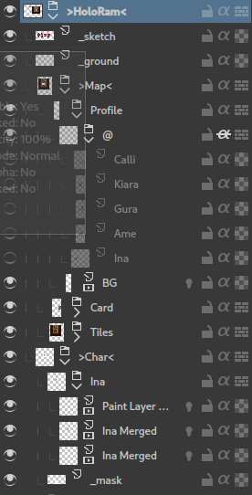

### Scripts

Useful python scripts

## Krita

Scripts:

- `flatten_mask` - select a mask and apply it to all siblings
  - especially useful with TransformMask and animation frames

Plugins:

- `toggle_docker` - toggle dockers/actions with shortcuts, since you can't switch workspaces with shortcuts...
  - add new actions for every docker in `createActions` and `toggle_docker.actions`

### Exporter

It is more complicated so I will explain in more detail what is can do.

Export layers and frames automatically.
Export bounds is selection, if none available and no `_mask` (see below) then use the node bounds

Special Names:

- `>Item`: export each child with group name as prefix, name e.g `Item_Sword`
- `>Item<`: export each child without group name
- `@Item`: export the parent for each of the children toggled, name e.g when child of `Sprite` group: `Sprite_ItemSword`
- `#Item`: skip the check for animation frames for this node
- `_Item` start: ignore
- `_mask` exact: every sibling will be exported using this mask as bounds

Example:

Following files will be exported when running with `>HoloRam<` node selected and using separator `_`:

- `Profile_Calli.png`
- `Profile_Kiara.png`
- `Profile_Gura.png`
- `Profile_Ame.png`
- `Profile_Ina.png`
- `Card.png`
- `Tiles.png`
- `Ina_0.png`
- `Ina_1.png`

The profile files will include the `BG` + each child of the `@` node.

The character `Ina` will have all frames exported using the bounds of `_mask`
